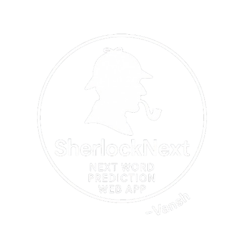

  

# SherlockNext – Next Word Prediction Web App

**Deployed App:** [https://vansh-textgen.streamlit.app/](https://vansh-textgen.streamlit.app/)  
**Developed by:** Vansh Kumar | Guided by Prof. Nipun Batra, IIT Gandhinagar

SherlockNext is a lightweight and interactive web app built with **Streamlit** that performs next-word prediction using a PyTorch model trained on *The Adventures of Sherlock Holmes* by Arthur Conan Doyle.

---

## Features

- **Next-Word Prediction**: Predicts the next few words based on user input using a trained language model.
- **Flexible Model Settings**: Choose embedding size, hidden layer size, and activation function from the sidebar.
- **Handles Unknown Words**: Replaces unknown words with the closest known ones using word embeddings and WordNet.
- **Interactive Interface**: Clean UI for real-time prediction and experimentation.
- **CUDA Support**: Utilizes GPU if available for faster inference.

---

The model generates the next words for your input using a fixed context size (block size). Users can configure model hyperparameters from the sidebar.

---

